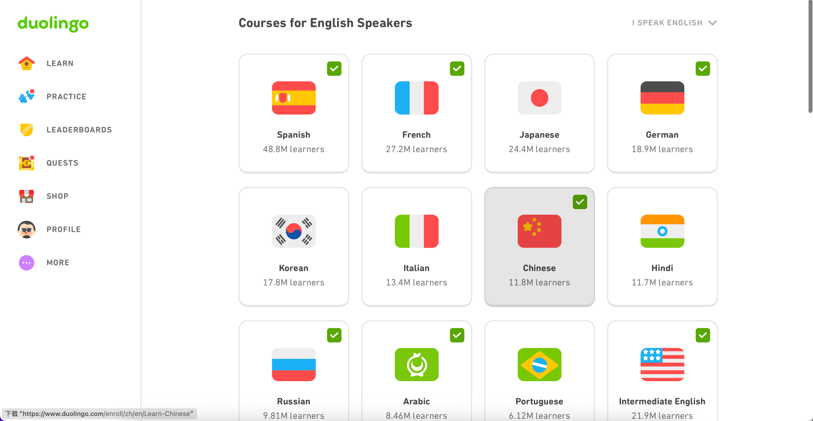
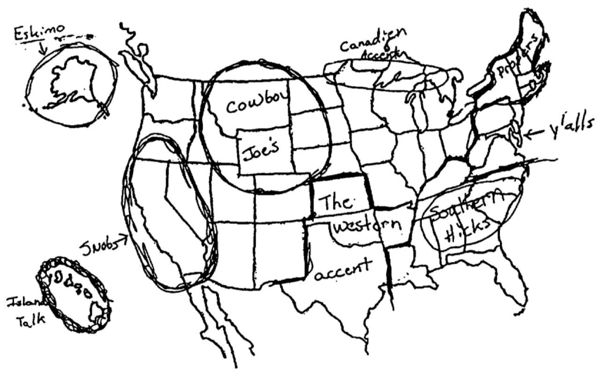

## Introduction to Sociolinguistics | Universiteit Leiden Summer School of Linguistics

with Professor Marina **Terkourafi**

### DAY 1: INTRODUCTION

#### What is sociolinguistics?

Formal Linuguistics: language in the brain, used by individuals.

Sociolinguistics: language in the real worl, used by groups.

#### Social Meaning

"Two ways of saying the same thing" Labov (1972: 188)

Sociolinguists are interested in how language conveys information not about the world but about **the language users themselves** through the user's choice of **words** (_soda, pop, coke_), **sounds** (_fourth floor, BrE / AmE_), **grammatical constructions** (_ain't no sunshine v.s. isn't any sunshine_), and also **material aspects** (_color v.s. colour; fonts; type v.s. handwritten_).

#### Sociolinguistics: Problems At Stake

- Languages in education
-
-

We describe, we don't prescribe. We document and we don't judge.

#### Two Principles sociolinguists have a duty to undertake (Labov, 1982)

- Error Correction 积极纠错: undo misconceptions and prejudices about languages. Labov 认为，语言学家应该积极发声，用科学证据说明：语言的多样性是正常的，每一种语言或变体都有其系统性和规则性，并不比“标准语言”低级。

- Debt incurred 回馈原则: benefit the communities who work with them to provide data for linguistic research. Labov 认为研究者不能只“拿走数据”，还应当思考如何帮助这些社区。

#### From speech communities to communities of practice

We must study groups of people.

- **Speech communities**: originally associated with people living in the same place
- **Social networks**: who the speaker socializes with
- **Communities of pratice**: who the speaker behaves alike (dress, habits, tastes)

#### Language at an age of de-territori-lization

Globolization

1. Scale: mass movement of people due to war, disease, economic chances, employment, study, as well as tourism.
2. transnational

#### Sociolinguistic definition of language

"Loose collections of complex and evolving form-functions patterns that arise out of the needs and the constriants of actual communication." (textbook p.9)

### DAY 2: IMAGINING NATIONS, IMAGINING LANGUGES

#### Nationalism

Identifies nations with territories / geographical areas.

#### Creating national languages

Goals to creating national languages:

- To unify internally 👉 Internal homogeneity;
- To distinguish them from others 👉 External distinction.

Language standardisation is a historical process with 3 stages:

1. Sleection of a local variety to serve as the supra-local standard
2. Codification (further regularised and elaborated)
3. Promulgation (spread thru schools, media, etc.)

#### Binding languages with flags?

What's wrong? It assumes that people coming form the same country all speak the same language (**monolingual ideology**), OR assumes that a language is only spoken in one way (**standard language ideology**).

#### Monolingual ideology

Some are officially bilingual: Both advantages and disadvanages.

Some countries does not have an official language: USA, UK, Australia.

##### How do we call non-official languages in a country?

**Minority** or **regional languages**.

#### Standard language ideology

##### How do we call different ways of speaking a language?

Dialects (grammatically different) or accent (pronunciationally different).

##### Advantages of standard language

unify and create a sense of belonging among people;
promote intelligibility.

##### Disadvantages of standard language

###### For speakers

discriminated.

###### For the language

resists language change over time.

### DAY 3: RESOURCE AND REPERTOIRE

#### Combining resources to generate meaning

Different languages: Russian, Deutsch, English;
Different varieties: "_faggots_" as in slang;
Different genres: stylized / informal;
Non-linguistics signs: "_$_" (refers to capitalism);
Different registers: character replacements common in graffiti;

> Meaning does not only come from texts. Meaning might be different to different people.

#### Communicative competence 交际能力

One's knowledge of how to use language appropriately in different situation. One's ability to choose from and make use of different resources in socially appropriate ways.

Different from Chomsky's **linguistic competence**: one's innate knowledge of the grammar and vocabulary of a particular variety.

#### Communicative resources & repertoires

Moving away from [communicative competence](#communicative-competence-交际能力) as a kind of internalized knowledge, recent interest is in **how individuals form repertoires/语言资源组合** as they move across different communities and social networks.

与其说脑子里有一套交际规则，现在更多语言学家认为**我们是在不断生活、移动、交流中，动态地积累和调整我们使用语言的方式的。**

##### Communicative resources

Pieces of language which people take from a range of different sources and which allow them to communicate not just "meanings" but also attitudes, etc.

Types of resources:

**Codes**: 一种完整的语言系统或语言变体。语言/方言。

**Registers**: 不同社会语境下的语言风格或语言使用方式。正式/非正式。

**Genres**: 体裁。Essay/paper/message/...。

#### (Code Switching 语码转换)

说话者在对话中切换使用两种或多种语言、方言、或语言变体的行为。

#### Indexicality 指示性

Semantic meaning 语意: the "meaning" of a word.

Indexical meaning 指示性意义: interactional / social meaning.

Charles Peirce: three types of signs:

**Icon**: (_an icon looks like what it means. e.g., images_)

**Symbol**: (_their meaning comes from convention. e.g. a word_)

**Index**: (_their meaning comes from "pointing to" sth in the physical world_).

#### Linguistic environments and 'values'

The resources used in a space and the symbolic value of these resources in that space taken together constitue a **linguistic environment**.

#### Heteroglossia 异语杂糅

The mixing of resources we use depending on the linguistic environment we are in and the resources we have access to, including how those resources are valued in that environment. 指人们根据语言环境和资源价值，在对话中灵活混用不同语言资源的现象（如中英夹杂、语体切换等）。

> Assignment for FriDAY's class:
> Find a picture that combines different types of resources to generate meaning, email to [m.terkourafi@hum.leidenuniv.nl](mailto:m.terkourafi@hum.leidenuniv.nl).

### DAY 4: LANGUAGE VARIATION

#### Pioneering European dialectologist

**Deutscher Sprachatlas** created by _Georg Wenker_ in Germany in 1876: mailed schools and asked _does this **rhyme** with that_ to research about vowels.

**Atlas linguistique de la France** created by _Jules Gilliéron_ in France in 1897-1901.

#### The Linguistic variable

"Two ways of saying the same thing."

E.g.:

- variable (-ng) and the end of English word has two variants: [ŋ] and [n].
- (-r) after a vowel in English has two variantsː [ə˞ ] and [∅].

#### Labov: Posvocalic -r in American English

##### Early 17th century

- all English speaking settlers in the New World pronounced their -r's

##### Mid-18th century

- -r starts to carry social meaning in the New World;
- wealthy settlers in Massachusetts and South lost -r thru contact with Southern BrE.
- r-less pronunciation prestigious/r-full stigmatized (indexes high SES in Massachusetts and the South).

##### After WWII

- r-full prestigious/r-full stigmatized;
- r-less pronunciation retained in Boston speech (pahk the cah in Hahvahd Yahd) + stigmatized in rest of country

#### Enregisterment

The process by which people attribute social meaning to linguistic variants.

= People begin to associate "what these people are like" and "how these people talk" thru:

- media: films, TV shows, books;
- material artifacts beyond language: T-shirts, mugs;
- metadiscourse: all comments about the way people talk (people from Beijing say "xxx")

#### Peter Trudgill's (1974) study in Norwich, UK

-ng: [ŋ] or [n]?

**Key findings:**

- Lower SES speakers used non-standard variants more than higher SES speakers
- Men used more non-standard variants than women.
- **_Self report: men tended to underreport (reported non-standard even if they used standard) and women tended to overreport._**

**Overt prestige**: prestige recognized by society at large.
**Covert prestige**: prestige recognized by subgroups (friend groups, etc.)

#### Lesley Milroy's (1980) Belfast study

vowel roundingː [ʌ] -> [ü]

Key findings: Speakers who have stronger social networks use non-standard forms more. Strong social networks ties reinforce norms. By contrast, speakers who are peripheral to their network are less bound by vernacular norms and may introduce innovations leading to language changes.

#### Penny Eckert's (1989) study of Jocks & Burnouts

Communities of practice

- variations in speech correlated with belonging in one of these "self-proclaimed" (emic) categories
- variation in speech was more pronounced in the speech of girls. Language then becomes their primary means for indexing their belonging in one of these communities of practice.

### DAY 5: MODES AND MEDIA OF COMMUNICATION

A Mode is a "regularized, organized set of resources for meaning making".

Communication has always been **multimodal**.

The rise of digital technologies increased the **mobility** for both people and informtion.

#### Meaning potential

「😴」could be bored, boring, sleepy or sth else.

「😇」could be happy, peace-and-love, dying or sth else.

The range of semantic and indexical meaning a communicative resource can be used to express constitute its **meaning potential**.

Meaning potential is socially constructed.

Different modes both enable and limit the kinds of things we can do with 'em:

Enable (affordances): images deliver information all at once as opposed to sequential information provided by writing.

Limit (constrains): expressing an emotion thru langauge makes it clear, thru an Emoji may leave it ambiguous.

#### Resemiotization

Expressing the same meaning in different modes.

I'm tired / 🥱

Resemiotisation changes opportunities for creating **indexical meaning**; has an impact on the access of diferent kinds of audiences to my message.

#### Recombination

「Liberté Égalité **Beyoncé**」

#### Recontextualization

Taking sth from one context and introducing it into a new context.

Recontextualization changes:

- meaning of a particular modal resource
- the status and relationships of the participtating individuals.

#### Media

#### Digital media

Digital media challenges the monolingual ideology as well as monomodal ideology.

### DAY 6: CODE MIXING, CODE MIXING, CROSSING, AND TRANSLANGUAGING

#### Linguistic purism

"Language police": Unmixed form of language should be used, or otherwise the language is deficient, corrupted or distorted.

#### Code combining

##### Code Mixing

Intra-sentential: combining linguistic units from different language **in the same sentence**.

##### Code Switching

Inter-sentential: combining language **across sentences**.

##### Why switching code?

**Situational code-switching**: change in situation, so the speaker _has to_ switch code.

👉 e.g., a bilingual speaker uses Spanish at home but switches to English at work.

**Metaphorical code-switching**: no change in situation, but a change in _topic, stance, or relationship_—the speaker chooses to switch code to achieve a certain social meaning.

👉 e.g., a speaker switches to a heritage language to show solidarity, intimacy, or emotional emphasis.

You have to be familiar enough to the language to switch codes.

**We-code** v.s. **They-code**: code used by in group v.s. out group.

#### Crossing

More recently, people started to use crossing instead of code mixing / switching.

When people mix codes in which they have **limited competence**, in effect, "appropriating" words or phrases from **other people's languages** and inserting them into their own.

#### Languag*ing* and translanguag*ing*

**Translanguaging** / **跨语际表达**: the fluid and dynamic pratice that many people engage in when they communicate that transcend the boundaries between named languages, language varieties, and language and other semiotic systems. 指现实中很多说话者在交流中灵活地混用多种语言、语言变体，甚至其他符号系统（如图像、手势）的做法。这种实践打破了语言之间的边界（如“英语”和“西班牙语”的分界），强调语言是动态的资源组合，而不是固定的“语言名称”系统。

### DAY 7 STYLE AND IDENTITY

#### Style is locally _and_ socially constructed

Language resources do not have meaning in isolation:

Their meaning depends on what other resources they are mixed with locally, on that occasion (**bricoage**)

It also depends on the group and social situations they are associated with more generally (their **social meaning**).

For these reasons, style is **never entirely individual**, nor **political**.

#### Identity as something we do (perform)

Four conditions on **acts of identity**:

(a) we can recognize the groups;

(b) we have both adequate access to the groups and ability to analyze their behavioral patterns;

(c) the motivation for joining the group is powerful, and is either reinforced or lessened by feedback from the group;

(d) we have the ability to modify our behavior.

#### Changing meanings of "style"

1960s-70s, Labov, Trudgill: style as attention to speech;

1980s, Bell: style as **audience design**; People change the way they speak because they are speaking to different people (audience). = [accomodation theory](#accomodation-theory)

#### Accomodation Theory

#### The Auditor effect

【「{[(Speaker) Addressee] Auditor} Overhearer」 Eavesdropper】

All kinds of listeners have an effect on how a speaker speaks but the further away from the speaker the listener is, the less they affect the speaker's style.

Explains the **Observer's Paradox**: sociolinguistis wish to observe how people talk when they are being **unobserved**.

#### Audience design on social media

- Context collapse: co-presence of different kinds of listener onsocial media is the rule rather than the exception.
- Audiences in online networks are even more diverse.
- **Referee design**: converging with the speech of one (or more) non-present person/groups because we want to be perceived to be like them.

### DAY 8: LANGUAGE ATTITUDES, MOCKING, AND APPROPRIATION

#### The power of the _stadard language ideology_ {#the-power-of-the-stadard-language-ideology}

- Language stigamatization is the result of the behavioural component of language attitudes, how we react to certain linguistic choices.

- Language attitude are opiions we have about language resources and they have 3 components:

  - Cognitive: veliefs about language resources. 💡 _"using a non-standard variant is a sign of low education."_
  - Affective: feelings toward a language resources. 💡 _"hearing a non standard variant makes me cringe."_
  - Behavioural: actions based on beliefs and feelings about language resources. 💡 Mocking, appropriation.

- We use language attitudes to make **predictions** about what others are like based on the way they speak, variety, grammatical structure.

#### Overt and covert language attitudes

Overt: evaluations consciously thought and openly expressed.

v.s.

Covert: evaluations we don't openly express because: it would be considered wrong to do so, or we are not aware that we have them (implicit biases).

To test language attitudes, we use [direct methods as well as indirect methods](#direct-methods-and-indirect-methods)

#### Direct methods and Indirect methods

##### Direct methods

- Questionnaires (piloting: test questionnaires to see if questions are clear for people)
- Interviews

##### Inderect methods

- **Matched-guise test**: same talker, different varient
- Verbal-guise test: different(but similar) talker, different varient.

##### Beyond direct and indirect methods

- **Folk linguistics** (Dennnis Preston's Perceptual Dialectology):

  - What varieties do people themselves distinguish? / where do they draw boundaries between varieties?
  - What do they think about these vairetis / what words do they use to talk about them?

(_Citizen Science: Involve people to collect data. E.g., ask people to count the number of birds outside their window_)

- **Citizen Sociolinguistics:** builds on the fact that people often spontaneously express their attitudes about the way other people speak over media, social media, and in their everyday conversations.

E.g., Stimmen fan Fryslân "_Voices of Fryslân_"; Norwegian project "_Taking the temperature on language!_".

#### Language mocking and appropriation

- Mocking: imitating the way other people speak in order to make fun of them.
  - a practice of **every-day racism**.
- Appropriation: imitating the way other people speak for personal gain or profit.
  - A kind of "stealing".
